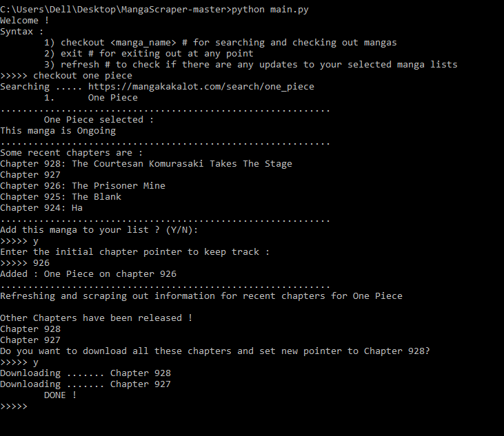
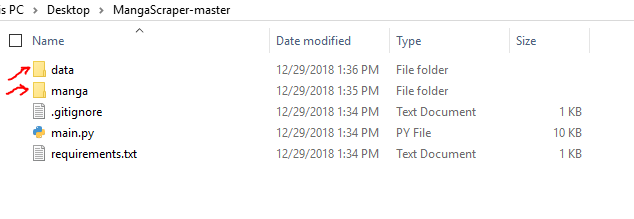
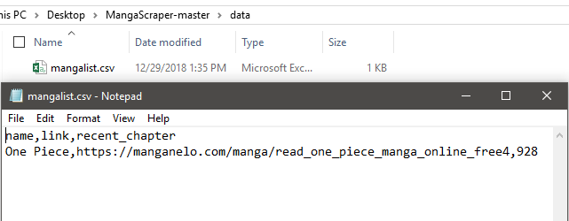
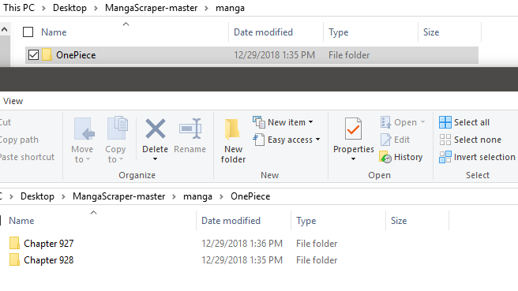

# Manga Scraper
MangaScraper is a simple python script that helps in making manga lists, so that you can checkout new manga chapters that you have missed and download the images directly to your machine.

It is a simplt CLI script that makes manga reading more faster,better and free of ads.

To use this script:
* Download the zip or clone from github
* Install the requirements from requirements.txt by using pip  ```pip install -r requirements.txt```

There are three basic functions:
1) ```checkout <manga_name>``` for searching and checking out mangas
2) ```exit``` for exiting out at any point
3) ```refresh``` to check if there are any updates to your selected manga lists

## Example
To checkout and add **One Piece** to manga list



If only one manga is found, it redirects to that specific one ,else you will have to specify one of the mangas from a list.
Also, the program displays some recent chapters and you can add to the list.You will also have to specify an index pointer to allow the program to keep record of new chapters from that pointer.

You will be redirected to the ```refresh <manga>``` function and you will have the option to download the chapters after the index pointer



The program will generate a **data/** folder with **mangalist.csv** file that contains your list and recent chapter.
Also,a **manga** folder will have all your downloaded manga chapters !

In order to remove a manga or change the recent chapter pointer you can directly modify the csv file.




